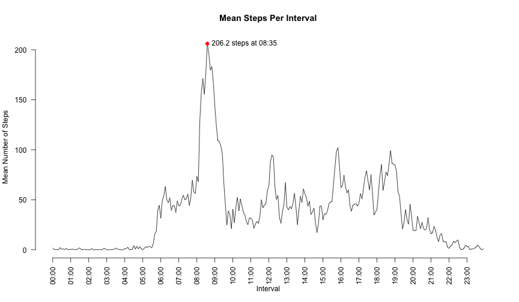
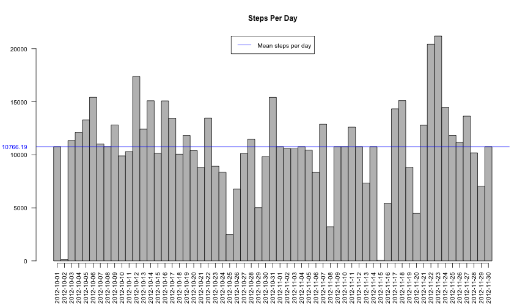

# Reproducible Research: Peer Assessment 1
We document the loading and basic analysis of provided activity data. Sections
below attempt to answer some of the questions posed, for the purpose of
completing the said peer assessed course project. All of the code required to
reconstruct the results is presented.
  
## Loading and preprocessing the data
In order to begin analysis, we load and summarize the data using R.

```r
    library(plyr)

    read_activity_data <- function(path = getwd()) {
        path = file.path(path, "activity.csv")
        df <- read.csv(path, colClasses=c("integer", "Date", "integer"))
    }

    raw <- read_activity_data()
```

The code reads a data file, **assumed to be named *'activity.csv'* in the current
working directory** with three variables *viz.* **steps**, **date** and **interval**. 
The raw data, thus read, is retained in the variable *raw* for further processing.

## What is mean total number of steps taken per day?
We plot the summary as a bar plot in R as shown below. In the function
*build_histogram()*, We summarize the data by computing the sum of steps
computed across each day. The barplot shows days along the horizontal x-axis and
the number of steps taken along the y-axis. The function returns the daily mean
and median of the data set in a vector.


```r
# Show histogram of the sum for each day. Plot the mean number of steps per day.
# Returns the value of the mean and median of the data set in a vector.
build_histogram <- function(raw) {
    # Compute the sum of daily steps for each day
    summary <- ddply(raw, .(date), .fun=summarize, sum=sum(steps))

    # Compute the mean and median steps across all days
    mu <- mean(summary$sum, na.rm=TRUE)
    mid <- median(summary$sum, na.rm=TRUE)
    
    # Plot histogram of steps each day
    par(ps=10)
    barplot(summary$sum, names.arg=summary$date, 
            space=0, las=2, axis.lty=1, main="Steps Per Day")
    
    # Plot the mean of the data
    abline(h=mu, col="blue")
    
    # And label it
    mtext(side=2, line=1, at=c(mu), format(digits=7, mu), las=2, col="blue")
    legend("top", c("Mean steps per day"), col = "blue", lty=1)
    
    # Return the mean and median
    c(mu, mid)
}

# Hold the mean and median of the data set.
mean_median <- build_histogram(raw)
```

 


The blue horizontal line represents the value of the the mean and has the 
value **10766.19 steps**. The median is 
**10765 steps** which too close to the mean to be shown
in the same plot.

**We use the *plyr* package to perform the summarization; therefore, it is needed
for the  above code to execute. In the case the package is not installed locally
in your R installation, please download and install it from CRAN.**

## What is the average daily activity pattern?
We proceed to compute the mean number of steps taken in each interval across all
days. This is plotted in the time series plot below. *We do not use the interval
identifiers at all since they are not evenly spaced*. Instead, we choose to use a
sequence (1:288; since there are 288 5-minute samples per day). We create the
labels from the interval identifiers though, interpreting them as time. This
work is performed by the function *interval_mean_timeseries()*, which returns
a _list_ with the the interval means (a data frame); the time (single character
vector) at which the maximum interval mean occurs; and value of this maximum (a
single numeric vector).


```r
    # Compute interval means
    interval_mean_timeseries <- function(raw, title="Mean Steps Per Interval") {
        interval_mean <- ddply(raw[, c("steps", "interval")], 
                               .(interval), .fun=summarize, 
                               mean=mean(steps, na.rm=TRUE))
        
        # Plot time series; we use intervals as 1:288 (the number of samples per
        # day) since the interval ids are not evenly space
        plot(1:nrow(interval_mean), interval_mean$mean, 
             type="l", xaxt='n', las=2,
             main=title,
             xlab="Interval", ylab="Mean Number of Steps", bty='n')
        
        # To draw the axis we provide labels of each hour to keep plot clean
        slice <- seq(from=1, to=283, by=12)
        labels <- sprintf("%2.2d:%2.2d",
                          as.integer(interval_mean$interval / 100),
                          interval_mean$interval %% 100)
        axis(1, las=2, at=slice, labels=labels[slice], tick=TRUE)
        
        # Plot the point with the maximum mean across all intervals
        max_mean <- interval_mean[interval_mean$mean == max(interval_mean$mean),]
        rowno <- as.integer(rownames(max_mean))
        points(rowno, max_mean$mean, pch=19, col="red")
        text(rowno, max_mean$mean, labels=paste(format(max_mean$mean, 6),
                                                "steps at", 
                                                labels[rowno]), 
             pos=4)
        
        # Return a list containing
        #   list[[1]] a data frame with means of each of the intervals
        #   list[[2]] a string with the time of maximum interval mean
        #   list[[3]] a numeric with the value of the maximum interval mean
        list(interval_mean, labels[rowno], format(max_mean$mean, 6))
    }

    interval_data <- interval_mean_timeseries(raw)
```

 


The maximum mean occurs at **08:35 hours** with a value of 
**206.2 steps** in the interval. This is indicated on the
plot above.

## Imputing missing values
To combat missing values (*NA* values for the **steps** variable), we replace
each missing value with the mean of the corresponding interval across all days.
The resulting data is plotted below.


```r
imputed <- raw 

# Repeat the interval means data nrow(imputed)/nrow(interval_mean) times. This
# comes up to 61 repetitions of the interval data. This allows us to replace
# each of the missing values with the corresponding mean for the interval.
means <- do.call("rbind", replicate(61, interval_data[[1]], simplify = FALSE))
idx <- is.na(imputed$steps)
imputed$steps[idx] <- means$mean[idx]

# Build the plot for the imputed data set
mean_median <- build_histogram(imputed)
```

 


Note that the mean and the median do not change with this method. The values
remain at **10766.19 steps** and
**10766 steps** for the mean and median respectively.

## Are there differences in activity patterns between weekdays and weekends?
To further compare activity data across days of a week, we label each row as
occuring on a weekday or weekend. We perform this on the imputed data frame.


```r
    imputed$weekday <- !(weekdays(imputed$date) %in% c("Saturday", "Sunday"))
```


We plot data by subsetting the weekday and weekend data separately resulting in
two plots.


```r
    par(mfrow=c(2, 1), oma=c(0, 0, 3, 0))
    wkday_intervals <- interval_mean_timeseries(imputed[imputed$weekday == T,],
                                                "Weekdays")
    wkend_intervals <- interval_mean_timeseries(imputed[imputed$weekday == F,],
                                                "Weekends")
    mtext("Mean Steps Per Interval", outer=T, cex=1.5)
```

 


We note that there is significant differences in the subject behavior during
weekdays as compared to weekends. In particular, the *maximum interval mean*
on **weekdays occurs at 08:35 hours** with a value of
**230.4 steps**. The corresponding data during **weekends is
09:15 hours** with a value of **166.6 steps**
